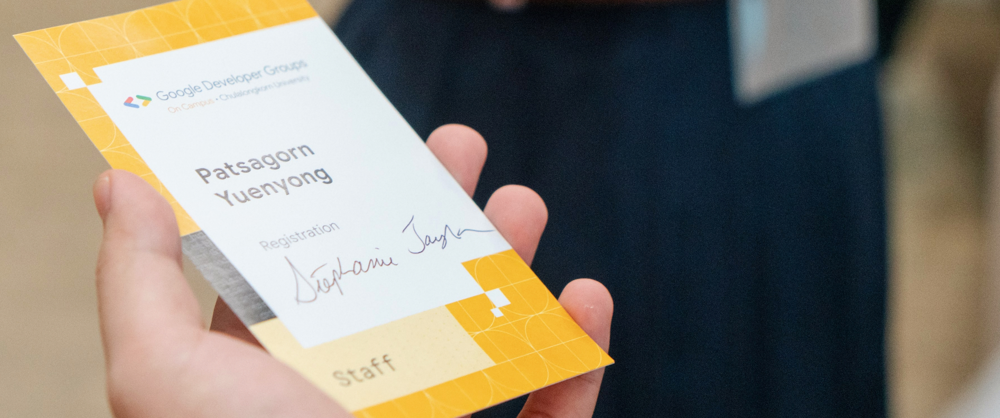

```js
  ██╗  ██╗  ███████╗ ██╗      ██╗       ██████╗  ██╗
  ██║  ██║  ██╔════╝ ██║      ██║      ██╔═══██╗ ██║
  ███████║  █████╗   ██║      ██║      ██║   ██║ ██║
  ██╔══██║  ██╔══╝   ██║      ██║      ██║   ██║ ╚═╝
  ██║  ██║  ███████╗ ███████╗ ███████╗ ╚██████╔╝ ██╗
  ╚═╝  ╚═╝  ╚══════╝ ╚══════╝ ╚══════╝  ╚═════╝  ╚═╝

  I am Patsagorn Yuenyong,  a  Computer Science sophomore at
  Chulalongkorn University, thailand. I am interested in Web
  Technology  and  Computational  Linguistics and believe in
  Opensource. Also Wikimedian,  Uncyclopedian  and EN <=> TH
  amateur translator.

  🔭 #Website: 'https://ptsgrn.dev'
  📝 #Blog: 'https://blog.ptsgrn.dev';
  🔬 #Labs: 'https://labs.ptsgrn.dev';
  📫 #How to reach Me:
      { Email: 'hello@ptsgrn.dev' }
      { Discord: '@patsagorn' }
      { Twitter: '@ptsgrn' }
      { LinkedIn: 'https://www.linkedin.com/in/patsagorn/' }
```


[](https://holopin.io/@ptsgrn)

